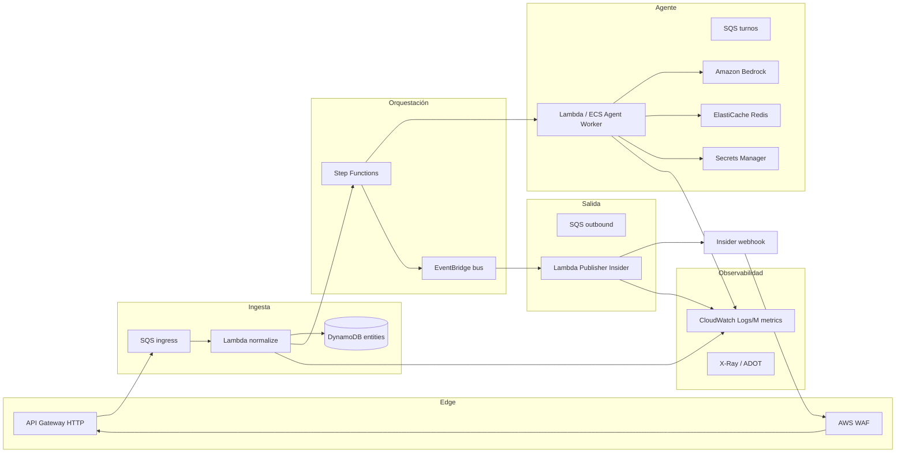
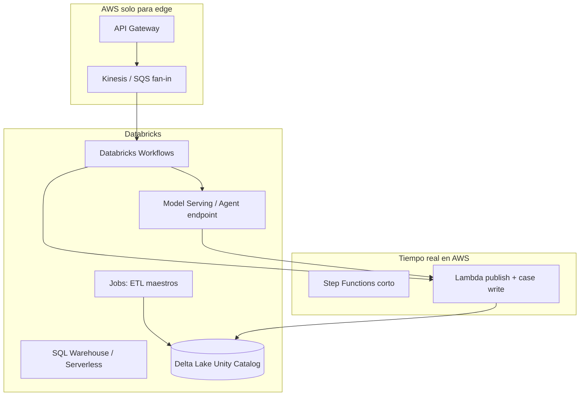

# Implementación E2E en AWS (Terraform) y Databricks

**Contexto:** Réplica del flujo documentado en [E2E-Insider-Trigger-to-Publish-Response-UAT.md](./E2E-Insider-Trigger-to-Publish-Response-UAT.md) y detalle de automatizaciones en [E2E-Automations-Detail-UAT.md](./E2E-Automations-Detail-UAT.md).

**Objetivo:** Para cada capacidad UnifyApps del camino Insider → Case → Login → Agente → Publish, proponer **servicios equivalentes**, **recursos Terraform (AWS)** y **contrapartes Databricks**, sin acoplar a IDs de UAT.

---

## 1. Cómo leer este documento

| Columna | Significado |
|---------|-------------|
| **UnifyApps (UAT)** | Qué hace hoy en Belcorp |
| **AWS (Terraform)** | Servicio + recursos típicos `aws_*` / proveedores relacionados |
| **Databricks** | Jobs, Workflows, Delta, serving, o integración con AWS |

**Recomendación de reparto (híbrido habitual en retail/CPG):**

- **AWS:** tiempo real (webhook, orquestación, agente, publish WhatsApp, secrets, colas).
- **Databricks:** analytics de casos/teléfono (`snowflake_case_level_2`), reporting, batch de maestros (diamond, testers), feature store opcional.

No es obligatorio usar ambos; las tablas indican alternativas si eliges una sola nube.

---

## 2. Arquitectura de referencia (AWS)



---

## 3. Arquitectura de referencia (Databricks-centric)



En la práctica, **WhatsApp outbound en segundos** casi siempre termina en **Lambda/ECS en AWS**; Databricks orquesta turnos largos, enriquecimiento y analytics.

---

## 4. Mapeo por capacidad (UnifyApps → AWS Terraform → Databricks)

### 4.1 Canal y contratos

| UnifyApps (UAT) | AWS + Terraform | Databricks |
|-----------------|-----------------|------------|
| `insider_on_new_message` (trigger) | `aws_apigatewayv2_api` + `aws_apigatewayv2_route` + `aws_lambda_function` (validación firma) o `aws_apigatewayv2_integration` → SQS | Evento vía **Partner Connect** o job triggered por webhook en AWS que escribe en **Delta** (`bronze.insider_events`) |
| Insider Trigger graph (~147 nodos) | **`aws_sfn_state_machine`** (Express para rutas cortas, Standard para login/slots) o **Amazon MWAA** si el grafo crece mucho | **Workflow** multi-task: tareas = ramas (Python/notebook); ramas complejas mejor en Step Functions + notebook solo para transform |
| `callables_call_automation` (sync/async) | SF **Task** → `lambda:InvokeFunction` o `states:startExecution` (nested SF); async = `sqs:SendMessage` + worker | Workflow task → ejecuta otro job o llama **SQL/API**; async = **Databricks Jobs** fire-and-forget |
| `skip: true` / feature flags | **AWS AppConfig** + `aws_appconfig_configuration_profile` | **Databricks Feature Flag** (tabla config) o **Lakehouse Federation** a AppConfig |
| Env vars (`Beauty_Consultant_Agent_Id`, `Base_Url_Prod_SB`) | **SSM Parameter Store** `aws_ssm_parameter` + **Secrets Manager** `aws_secretsmanager_secret` | **Databricks Secrets** scope + **Variable** en job; URLs en secret scope |

### 4.2 Case hub (Case Management `674afe5a`)

| UnifyApps | AWS + Terraform | Databricks |
|-----------|-----------------|------------|
| `storage_by_unifyapps_*` CRUD | **DynamoDB** `aws_dynamodb_table` (PK `caseId`, SK `entityType#id`) o **Aurora PostgreSQL** `aws_rds_cluster` si necesitas SQL/joins fuertes | **Delta** `silver.service_hub_case`, `silver.service_hub_message` con **Unity Catalog**; escrituras RT vía **Delta Live Tables** o **Auto Loader** desde Kinesis |
| `PREVIOUS_FAN_MESSAGE` | Transacción **TransactWriteItems** (case + message) o stored proc Aurora | **MERGE** en Delta con idempotency key `messageId` |
| `triggeredFromAutomationId` | Atributo en item Dynamo / columna audit | Columna + **lineage** en UC |
| Attachments | **S3** `aws_s3_bucket` + metadata en Dynamo; **CloudFront** opcional | Archivos en **S3** (mismo bucket) + registro Delta `service_hub_attachment` |

**Terraform (ejemplo mínimo Dynamo case + message):**

```hcl
resource "aws_dynamodb_table" "service_hub" {
  name         = "${var.prefix}-service-hub"
  billing_mode = "PAY_PER_REQUEST"
  hash_key     = "pk"
  range_key    = "sk"

  attribute {
    name = "pk"
    type = "S"
  }
  attribute {
    name = "sk"
    type = "S"
  }
  attribute {
    name = "gsi1pk"
    type = "S"
  }

  global_secondary_index {
    name            = "by-customer"
    hash_key        = "gsi1pk"
    projection_type = "ALL"
  }

  ttl {
    attribute_name = "ttl"
    enabled        = true
  }
}
```

Patrón de claves sugerido: `pk = CASE#<caseId>`, `sk = MSG#<messageId>`, `gsi1pk = FAN#<fromCustomerUserId>`.

### 4.3 Identidad, país, login (Detect `67487a0f`, LoginSDK `693e98e0`)

| UnifyApps | AWS + Terraform | Databricks |
|-----------|-----------------|------------|
| Detect Country / Groovy prefix | Lambda **normalize-phone** (misma lógica que Groovy) | Notebook/Python compartido empaquetado como **wheel** consumido por Lambda y Databricks |
| `belcorp_customer_number` upsert | Dynamo o Aurora tabla `customer_identity` | Delta `gold.belcorp_customer_number` + API RT en AWS leyendo cache Redis |
| `snowflake_case_level_2` update | **Kinesis Data Firehose** → S3 → **Glue** → Redshift/Spectrum **o** omitir si migras analytics a Databricks | **Delta** `gold.snowflake_case_level_2` (nombre legacy); ingest batch/stream desde eventos case |
| `belcorp_tester` lookup | Dynamo tabla pequeña o SSM list | Delta maestro + cache en Redis |
| HTTP `/api/login`, Refresh, verify | **`aws_apigatewayv2_api`** (proxy) + Lambda **login-sdk-adapter** **o** VPC Link a API Belcorp existente; no reimplementar login en SF | Job de **validación/regresión** contra API QA; no path crítico RT |
| Tokens nodo `NeZyF` | **ElastiCache Redis** `aws_elasticache_replication_group` TTL + cifrado; clave `session:{caseId}` | Evitar tokens en Delta; solo métricas de login OK/Fail |
| `belcorp_master_data` | Dynamo / Aurora | Delta maestro sincronizado nightly |
| Encrypt phone (Groovy XOR) | Lambda util compartida; clave en Secrets Manager `API_Key_Prod_Login` | Misma lib Python en wheel |

### 4.4 Diamond / skills / transfer

| UnifyApps | AWS + Terraform | Databricks |
|-----------|-----------------|------------|
| Check diamond `676db02f` | Lambda + Dynamo `belcorp_diamond_consultants` (GSI por código/teléfono) | Delta maestro + **online feature** opcional en Redis |
| `belcorp_skill_type` update | Dynamo item por `caseId` o sidecar table | Delta + stream de eventos |
| Diamond Consultant `676dae39` | SF rama → Lambda publish + call transfer workflow | Workflow task + Lambda publish |
| Custom COPILOT `675d880d` | SF Choice on `toCustomerUserId` → nested SF (`6752da8f` / `67e6230f` equivalents) | Workflow branches |
| Case `Transferred` | EventBridge event `CaseTransferred` | Delta audit + dashboard SQL |

### 4.5 Runtime agente (Async `6732f708` → Core `66966960` → Executor `67850d22`)

| UnifyApps | AWS + Terraform | Databricks |
|-----------|-----------------|------------|
| Trigger AI Agent Async (`synchronous: false`) | API responde 202; **SQS** `agent-turns` + Lambda/ECS worker | Job async en Workflow (menos latencia que AWS para chat) |
| Trigger AI Agent (sync path interno) | Lambda **agent-orchestrator** invocado desde SF | Notebook/task **agent-orchestrator** |
| Prerequisites loop | SF Map state o Step Functions **Distributed Map** | Workflow **for each** task |
| Emit signal / HITL | **API Gateway callback** + token en Dynamo `pending_signals`; o **Amazon Connect** si humano | **Human-in-the-loop** externo (Connect); Databricks no ideal para espera interactiva |
| `e_ai_agent_conversation_state` | Dynamo `conversation_state` PK `caseId#agentId` | Delta RT suboptimal; usar Dynamo/Redis |
| Prompt Builder `6783284f` | Lambda **prompt-builder** | Python task leyendo config |
| System Prompt Builder `67834374` | Lambda compone: tools + template + optional context automation | SQL + Python task; tools desde UC registry |
| Get Agent Tools `67e26f9c` | **Dynamo** config table + **Lambda** tool registry; governance en **IAM** + **resource policies** | Tabla Delta `ai_agent_tool_catalog` + **MLflow** registered tools |
| Model Based System Prompt `67d5ca38` | Lambda + plantilla **Jinja2** en S3 | Notebook/template en repo |
| User/Assistant prompts `679629c4` | Query Dynamo messages GSI + truncate window | SQL Warehouse sobre Delta messages |
| LLM loop `6851442f` / cache `698edb1f` | **Amazon Bedrock** `InvokeModel` / **Converse** + tool use; cache en Dynamo `cached_status` | **Model Serving** endpoint (Llama/Mistral) o **External Models** (Bedrock); `cached_status` en Delta o Redis |
| Tool = callable automation | **Lambda** por tool (IaC: `aws_lambda_function` × N) + **EventBridge** para async tools | **Python wheel** tasks o **Databricks Apps** (HTTP) por tool |
| `complete` / error handler | SF Catch → Lambda publish fallback | Workflow on_failure → notification |

**Terraform (cola + worker agente):**

```hcl
resource "aws_sqs_queue" "agent_turns" {
  name                       = "${var.prefix}-agent-turns"
  visibility_timeout_seconds = 300
  redrive_policy = jsonencode({
    deadLetterTargetArn = aws_sqs_queue.agent_turns_dlq.arn
    maxReceiveCount     = 5
  })
}

resource "aws_lambda_event_source_mapping" "agent_worker" {
  event_source_arn = aws_sqs_queue.agent_turns.arn
  function_name    = aws_lambda_function.agent_worker.arn
  batch_size       = 1
}
```

**Bedrock (permisos IAM en Terraform):**

```hcl
resource "aws_iam_role_policy" "agent_bedrock" {
  name = "bedrock-invoke"
  role = aws_iam_role.agent_worker.id
  policy = jsonencode({
    Version = "2012-10-17"
    Statement = [{
      Effect   = "Allow"
      Action   = ["bedrock:InvokeModel", "bedrock:Converse"]
      Resource = var.bedrock_model_arns
    }]
  })
}
```

### 4.6 Publish Response → Insider Publisher

| UnifyApps | AWS + Terraform | Databricks |
|-----------|-----------------|------------|
| `conv_ai_by_unifyapps_publish_response` | Contrato interno: evento **`OutboundMessageRequested`** en EventBridge `aws_cloudwatch_event_bus` | Publicar evento a **AWS EventBridge** vía **Databricks Partner** o HTTP a Lambda |
| `__ua__publish_response_interface` | **EventBridge rule** + target por `channelName=insider` | N/A (router en AWS) |
| `defaultFallbackWorkflowId` | Rule de menor prioridad → Lambda generic publisher | Lambda fallback |
| Insider Publisher `67614f02` | Lambda **insider-publisher** (multipart, media S3 → Insider CDN APIs) | No sustituir; invocar Lambda desde Databricks vía **REST** si hace falta |
| `callables_from_interface` START | Lambda handler único con schema versionado (OpenAPI en S3) | OpenAPI client generado |

**EventBridge (router publish):**

```hcl
resource "aws_cloudwatch_event_rule" "publish_insider" {
  name           = "${var.prefix}-publish-insider"
  event_bus_name = aws_cloudwatch_event_bus.conversation.name
  event_pattern = jsonencode({
    detail-type = ["OutboundMessageRequested"]
    detail = {
      channel = ["insider"]
    }
  })
}

resource "aws_cloudwatch_event_target" "publish_insider_lambda" {
  rule           = aws_cloudwatch_event_rule.publish_insider.name
  event_bus_name = aws_cloudwatch_event_bus.conversation.name
  arn            = aws_lambda_function.insider_publisher.arn
}
```

### 4.7 Media, audio (Deepgram en Trigger)

| UnifyApps | AWS + Terraform | Databricks |
|-----------|-----------------|------------|
| Deepgram / transcripción | Lambda → **Amazon Transcribe** o API Deepgram con secret; audio en S3 | Batch transcribe en Job sobre archivos S3 |
| User Input Handling `682dc974` | SF Wait + Dynamo lock `user_input_pending` | Workflow con **timeout** task |

### 4.8 Observabilidad y trazas

| UnifyApps | AWS + Terraform | Databricks |
|-----------|-----------------|------------|
| Run logs / node logs | **CloudWatch Logs**; correlación `caseId`, `executionArn` | **Databricks audit logs** + **system tables** |
| Conversation traces | **OpenTelemetry** → **ADOT** → X-Ray / AMP | MLflow traces para LLM |
| Debug `debug_agent` | Log group dedicado + métrica `FailedAgentTrigger` | Dashboard SQL errores |

---

## 5. Mapa de objetos storage → datastore

| `object_type` (UAT) | AWS recomendado | Terraform principal | Databricks (Delta / UC) |
|---------------------|-----------------|---------------------|-------------------------|
| `service_hub_case` | Dynamo / Aurora | `aws_dynamodb_table` o `aws_rds_cluster` | `silver.service_hub_case` |
| `service_hub_message` | Misma tabla (SK distinto) o tabla hija | índices GSI | `silver.service_hub_message` |
| `service_hub_attachment` | S3 + metadata Dynamo | `aws_s3_bucket`, `aws_dynamodb_table` | `silver.service_hub_attachment` |
| `belcorp_customer_number` | Dynamo | `aws_dynamodb_table` | `gold.belcorp_customer_number` |
| `belcorp_master_data` | Dynamo / Aurora | idem | `gold.belcorp_master_data` |
| `belcorp_skill_type` | Dynamo por case | idem | `gold.belcorp_skill_type` |
| `belcorp_diamond_consultants` | Dynamo maestro | idem | `gold.belcorp_diamond_consultants` |
| `belcorp_tester` | Dynamo pequeño | idem | `gold.belcorp_tester` |
| `snowflake_case_level_2` | Firehose+S3 **o** skip | `aws_kinesis_firehose_delivery_stream` | `gold.case_phone_analytics` |
| `e_ai_agent_conversation_state` | Redis + Dynamo backup | ElastiCache + Dynamo | No RT |
| `e_session_task_state` | Redis TTL | ElastiCache | No RT |
| `ai_agent` / deployment | S3 config + Dynamo | S3 + Dynamo | UC **registered model** + YAML config |
| `cached_status` | Dynamo TTL | `aws_dynamodb_table` ttl | Redis preferido |
| `anonymous_users` | Dynamo | idem | Delta si reporting |
| `debug_agent` | CloudWatch only | log group | system tables |

---

## 6. Step Functions como sustituto del Insider Trigger (esqueleto)

Agrupa las ramas UAT en **estados de alto nivel** (no 1:1 con 147 nodos al inicio):

| Estado SF | Automatizaciones UAT aproximadas |
|-----------|----------------------------------|
| `NormalizeInsiderEvent` | START + geo/reaction/CLOSE |
| `PersistCaseMessage` | Case Management |
| `DetectCountryChannel` | `67487a0f` |
| `CheckDiamond` | `676db02f` |
| `LoginSdkGate` | `693e98e0` (Choice `isValid`) |
| `EnqueueAgentTurn` | `6732f708` |
| `HandleTransferred` | COPILOT `675d880d` |
| `PublishDirect` | ramas publish sin agente |

**Terraform:**

```hcl
resource "aws_sfn_state_machine" "insider_ingress" {
  name     = "${var.prefix}-insider-ingress"
  role_arn = aws_iam_role.sfn.arn
  definition = templatefile("${path.module}/state_machines/insider_ingress.asl.json", {
    persist_case_lambda_arn = aws_lambda_function.persist_case.arn
    detect_country_arn      = aws_lambda_function.detect_country.arn
    login_sdk_arn           = aws_lambda_function.login_sdk.arn
    agent_enqueue_arn       = aws_lambda_function.agent_enqueue.arn
  })
}
```

El agente pesado (**Executor + Bedrock loop**) conviene en **segunda** state machine `agent-executor` disparada por SQS, no dentro del camino caliente del webhook.

---

## 7. Databricks: qué usar para cada fase

| Fase E2E | Servicio Databricks | Notas |
|----------|---------------------|-------|
| Ingesta histórica / replay | **Auto Loader** desde S3 `bronze/insider/` | Idempotencia `messageId` |
| Maestros diamond/tester | **Job** programado | Reemplaza fetch storage en caliente si toleras cache |
| Analytics teléfono/país | **SQL Warehouse** + dashboards | Sustituto natural de `snowflake_case_level_2` |
| Composición prompt offline | Notebook + **MLflow** prompt registry | Runtime RT sigue en AWS Lambda |
| Tool catalog governance | **Unity Catalog** + permisos | Equivalente a tool governance UnifyApps |
| LLM (opcional centralizado) | **Model Serving** o **AI Gateway** (DBRX / external) | Latencia vs Bedrock en AWS |
| Orquestación larga | **Workflows** | Prerequisites, batch; no webhook directo |

**Integración AWS ↔ Databricks (Terraform):**

- `databricks_mws_network_connectivity_config` / **VPC endpoints** (según workspace).
- **Instance profile** / **UC storage credential** para S3 case bucket.
- **Service principal** para que Step Functions invoque **Jobs API** (`POST /api/2.1/jobs/run-now`) en pasos no críticos.

Proveedor Terraform: `databricks/databricks` además de `hashicorp/aws`.

---

## 8. Módulos Terraform sugeridos (estructura repo)

```
terraform/
├── envs/
│   ├── uat/
│   └── prod/
├── modules/
│   ├── edge/              # API Gateway, WAF, ACM
│   ├── messaging/         # SQS, EventBridge, DLQ
│   ├── orchestration/     # Step Functions, IAM
│   ├── data/              # DynamoDB, S3, ElastiCache
│   ├── agent/             # Lambda/ECS, Bedrock IAM
│   ├── publish/           # insider-publisher Lambda
│   ├── secrets/           # SSM, Secrets Manager
│   └── observability/     # CloudWatch, alarms, X-Ray
└── databricks/
    ├── workspace/         # catalog, schemas, grants
    ├── jobs/              # maestros + analytics
    └── serving/           # opcional
```

Variables globales a alinear con UAT:

| Variable UAT | Terraform / SSM |
|--------------|-----------------|
| `Beauty_Consultant_Agent_Id` | `var.beauty_consultant_agent_id` |
| `Base_Url_Prod_SB` / Login API | `aws_ssm_parameter` secure string |
| `API_Key_Prod_Login` | Secrets Manager |
| Conexión Insider | Secrets Manager JSON `{ api_key, partner_id }` |
| Insider webhook path | API Gateway route `POST /webhooks/insider` |

---

## 9. Orden de implementación (Terraform + AWS)

1. **edge + messaging:** API Gateway, WAF, SQS ingress, DLQ, idempotencia Dynamo `processed_events`.
2. **data plane:** Dynamo service_hub + S3 attachments + Redis session.
3. **Case Management Lambda** + transacciones.
4. **EventBridge bus** + esquema `OutboundMessageRequested`.
5. **Insider Publisher Lambda** (paridad con `67614f02`).
6. **Step Functions ingress** (normalize → case → country → diamond).
7. **Login adapter** (HTTP a API Belcorp existente) + gate en SF.
8. **Agent worker** (SQS + Bedrock + tool Lambdas).
9. **Prompt/tools services** (config en S3/Dynamo).
10. **Observabilidad** dashboards + alarmas DLQ.
11. **Databricks** (opcional fase 2): Delta gold + jobs maestros + SQL analytics.

---

## 10. Paridad funcional mínima (checklist)

| Capacidad UAT | AWS | Databricks |
|---------------|-----|------------|
| Mensaje WhatsApp entra y persiste case/message | ✓ SF + Dynamo | Delta vía stream (async) |
| Publish texto/media a Insider | ✓ Lambda publisher | Invocar Lambda |
| Agente responde async al fan | ✓ SQS + Bedrock | Solo si serving en DBX |
| Login SDK + segundo trigger si válido | ✓ SF Choice + Redis tokens | N/A RT |
| Diamond / skill type | ✓ Dynamo maestros | Job refresh Delta |
| System prompt + tools | ✓ Lambda chain | Config en UC |
| Trazabilidad por `caseId` | ✓ logs/metrics | SQL audit |

---

## 11. Riesgos y decisiones

| Tema | Recomendación |
|------|----------------|
| Reescribir 147 nodos 1:1 | **No**; agrupar en ~10–15 estados/lambdas y portar reglas críticas (voz, transfer, login gate). |
| Login Belcorp | Mantener **API existente** detrás de adapter; no mover identidad a Databricks. |
| Latencia WhatsApp | Publisher + case write en **AWS** misma región que Insider egress. |
| Bedrock vs Databricks LLM | **Bedrock** en AWS para producción chat; Databricks para experimentación y SQL agent. |
| Coste Step Functions | Express para webhook; Standard solo donde necesites esperas largas (slots → Connect o callback). |

---

## 12. Referencias cruzadas

| Documento | Uso |
|-----------|-----|
| [E2E-Insider-Trigger-to-Publish-Response-UAT.md](./E2E-Insider-Trigger-to-Publish-Response-UAT.md) | Flujo lógico y IDs UAT |
| [E2E-Automations-Detail-UAT.md](./E2E-Automations-Detail-UAT.md) | Nodos, HTTP, objetos por automatización |
| §8 Blueprint (doc E2E) | Patrones genéricos previos |

---

*Documento de arquitectura objetivo; no despliega recursos. Ajustar nombres de tablas Delta y state machines a estándares Belcorp antes de aplicar Terraform en prod.*
