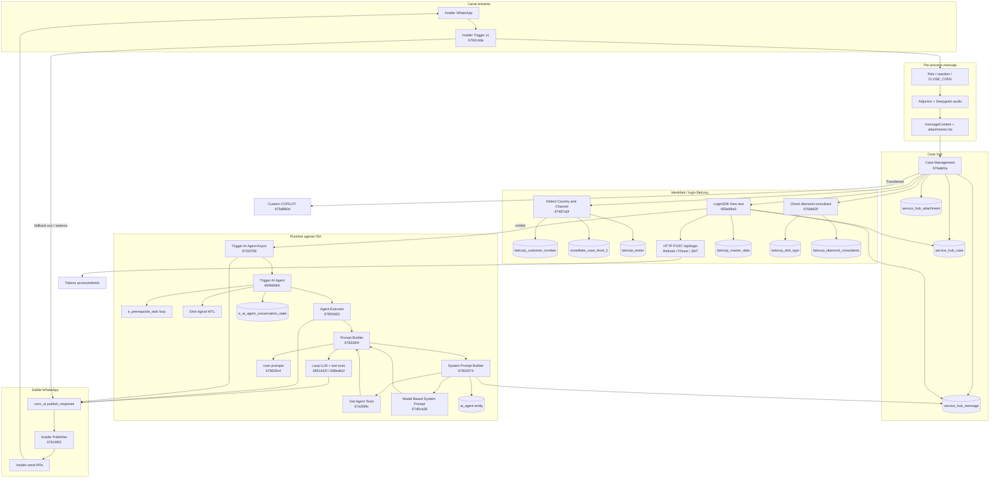

# Mapeo técnico E2E: Insider Trigger → Publish Response (Belcorp UAT)

**Entorno:** Belcorp UAT (UnifyApps)  
**Alcance:** Flujo desde webhook Insider hasta entrega WhatsApp vía Publish Response  
**Fecha de extracción:** 2026-09-25  
**Automatizaciones ancla:**

| ID | Nombre |
|----|--------|
| `6762c4dac2f4913e6ab8a309` | Insider Trigger- v1 |
| `67614f02eb7c6a04b9dba6dc` | Insider Publisher - v1 |

---

## Resumen ejecutivo

| Punto | Automatización | Rol |
|--------|----------------|-----|
| **Entrada canal** | `6762c4dac2f4913e6ab8a309` — **Insider Trigger- v1** | Webhook/evento WhatsApp (Insider) → normalización → caso/mensaje → dispara agente o respuestas directas |
| **Salida canal** | `67614f02eb7c6a04b9dba6dc` — **Insider Publisher - v1** | Implementación del contrato **Publish Response** para Insider (texto, media, botones, listas) |

Entre ambos **no hay un único `call automation` directo**. El enlace es la plataforma:

`conv_ai_by_unifyapps_publish_response` → `callableInterfaceId: __ua__publish_response_interface` → workflow registrado para el canal (**Insider Publisher**, START con `callables_from_interface` + `callableInterfaceId: 66e80063f5ec4205eb06242c`).

---

## Diagrama lógico E2E (ampliado)

Incluye identidad/login, composición de prompt/tools y publish.



---

## A. Dónde se genera el system prompt

El **texto final enviado al LLM como system prompt** no vive en el Insider Trigger; se compone en cada turno del agente dentro del **Agent Executor**, vía la cadena **Prompt Builder → System Prompt Builder**.

### A.1 Orquestador: Prompt Builder (`6783284f44ce135db1dab279`)

Invocado desde **Agent Executor** (`In9h9`) con:

| Parámetro | Origen típico |
|-----------|----------------|
| `agentId` | `Beauty_Consultant_Agent_Id` (env) |
| `caseId` | Case Management |
| `task` / `taskId` | Routing de topic en executor |
| `instructionsToAppend` | Contexto dinámico del turno |

**Pasos relevantes (orden lógico):**

1. **`JYICZ` → System Prompt Builder** (`67834374fc387b38c73b7972`) — produce `systemPrompt` base + primera tanda de `availableTools`.
2. **Merge de tools** en listas (`n_nSUUP`, `n_l7zuW`, …): agrega tools del system prompt builder, tools text2sql, DeepResearch sintético, etc.
3. **`Tf7vw` → User prompts** (`679629c41a248f0b3415c3b1`) — arma historial/mensajes usuario (`messages[]`) para el LLM.
4. **`_izuMg` → text2sqlTools** (`68aef17c8b592a6537a56099`) — tools extra si aplica agente SQL.
5. Lee **`e_ai_agent_conversation_state`** y **`e_topic_ai_agent`** para flags (defer tools, multi-agent, prompt caching).
6. **STOP `hd65i`** devuelve al executor: `systemPrompt`, `availableTools`, `messages`, `modelId`, `memoryEnabled`, `promptCachingSettings`, etc.

### A.2 System Prompt Builder (`67834374fc387b38c73b7972`) — núcleo del system prompt

| Paso | Nodo / automation | Qué aporta |
|------|-------------------|------------|
| 1 | **`9dbcQ` → `67e26f9c2807cf04c7f860db`** (*Get Agent Tools and Attributes*) | **`availableTools[]`** (id, name, description, `toolInputSchema`, governance) + atributos del agente (model, topic, memory, filters…) |
| 2 | **`jNHUU` → `67d5ca385c39266befb90a21`** (*Model Based System Prompt Builder*) | **`compiledTemplate`** a partir de `systemPromptInstructions`, `goal`, `role`, content filters, patterns del agente |
| 3 | Fetch **`ai_agent`** (object storage por `agentId`) | Config del agente en runtime (`preProcessingSettings`, default tools, response settings) |
| 4 | Fetch último **`service_hub_message`** FAN | Texto del último mensaje usuario para contexto |
| 5 | Si existe `preProcessingSettings.systemPromptSetting.addContextAutomationId` | Call automation dinámico → **`additionalContext`** concatenado al template |
| 6 | Groovy **`n_UcIPe`** | `finalSystemPrompt = compiledTemplate + additionalContext` |
| 7 | STOP | Retorna `systemPrompt` final + **`availableTools`** (copiados del paso 1) + model/stream flags |

**Fuente estática vs dinámica:**

| Componente | Fuente |
|------------|--------|
| Instrucciones base ISA | Entidad **`ai_agent`** (`properties.instructions` / `systemPromptInstructions` vía atributos) |
| Template compilado | Automation **Model Based System Prompt Builder** |
| Contexto extra por caso | Automation id configurado en **`ai_agent.preProcessingSettings`** (opcional) |
| Mensajes multi-turn | **User prompts** + historial en **`service_hub_message`** |

### A.3 Uso en el LLM (Agent Executor)

Tras Prompt Builder, el executor inyecta `In9h9.outputs.systemPrompt` y `In9h9.outputs.availableTools` en automations de inferencia (**`6851442f9e30586f552a6d73`**, **`698edb1fbd2e947f513f67cf`**, route-cache **`698b468d88aff64481e1510f`**, etc.).

---

## B. Dónde se hace retrieval / selección de tools

Hay **tres capas** distintas (no confundir):

### B.1 Registro y metadata (retrieval “estático”)

- Automation **`67e26f9c2807cf04c7f860db`** (*Get Agent Tools and Attributes*), llamada desde **System Prompt Builder**.
- Lee configuración desplegada del agente: entidades **`e_action_ai_agent`** (tools/tasks), **`e_topic_ai_agent`**, governance (`governanceConfig`), versión en **`ai_agent_deployment`**.
- Salida: lista **`availableTools`** con JSON Schema por tool (lo que el LLM ve en el turno).

### B.2 Ensamblado por turno (retrieval “dinámico”)

- **Prompt Builder** fusiona:
  - Tools del system prompt builder
  - Tools text2sql (`68aef17c…`)
  - Tool sintético **DeepResearchTool** (Groovy + schema inline) si flags de session/agent
  - Ajustes por **`e_ai_agent_conversation_state`** / **`e_topic_ai_agent`** (`deferToolLoading`, route agent cached)

### B.3 Ejecución (invocación)

- **Agent Executor** loop: cuando el LLM elige una tool, call automations registradas (cada **`e_action_ai_agent`** apunta a un workflow callable).
- **`referFromKnowledge`**: tool built-in de plataforma (no es automation Belcorp); usa documentos **`knowledge`** ligados al agente — no aparece como nodo en Insider Trigger, pero forma parte del catálogo del agente ISA.
- **Prerrequisitos pre-LLM**: **Trigger AI Agent** (`66966960`) recorre **`e_prerequisite_task_ai_agent`** y ejecuta automations **antes** del executor (contexto Belcorp, no necesariamente “tools” visibles al LLM).

### B.4 Governance (filtrado)

- Filtros en **`e_action_ai_agent.properties.governanceConfig`** (ej. país vía `__ua_pre_req`) reducen qué tools entran en `availableTools` — evaluados en **Get Agent Tools**, no en Insider Trigger.

---

## C. Login e identidad (¿hay login?)

**Sí.** No es login de consultora en WhatsApp (OAuth del usuario final en el chat), sino **identificación Belcorp + tokens API** para que tools backend llamen servicios con `accessToken` / `refreshToken`.

### C.1 LoginSDK New test (`693e98e086c48457515a14d9`)

- **Invocación desde Insider Trigger:** nodo **`n_Ru4wP`** (sync) con `{ caseId }`, **antes** del segundo disparo al agente.
- **Retorno usado en trigger:** `isValid`, `UserType`, `Channel`, `Country`, `RefreshToken`, `result`.
- **Gate:** condición **`n_sFiCl`** (`isValid == true`) → solo entonces **`n_SmEgF`** vuelve a llamar **Trigger AI Agent Async**.

**Flujo interno (resumen):**

1. Lee **`service_hub_case`**, **`service_hub_message`** (tipo `bot`), **`belcorp_master_data`** (por `caseId`).
2. Ramas según estado del usuario (consultora vs postulante vs cliente, tokens existentes, etc.).
3. HTTP **`custom_http_endpoint`** hacia **`/api/login`** con modos vistos en el grafo:
   - **Login (Refresh Token)** — body con `refresh_token`
   - **Login (Phone)** — usa `{{ __ENV__.outputs.API_Key_Prod_Login }}`
   - **Login (JWT)**
   - **Facebook login SDK** (rama específica)
4. Nodo variables **`NeZyF`** guarda **`accessToken`**, **`refreshToken`**, **`expiry`** tras login exitoso.
5. Persiste en **`belcorp_master_data`** / **`belcorp_customer_number`** (tokens, UserType, país, canal).

### C.2 Detect Country and Channel (`67487a0fda695160fbebe499`)

- **Invocación desde Insider Trigger:** **`_eDXO9`** justo después de Case Management (con `{ caseId }`).
- **Retorno:** `phoneNumber` (usado por diamond check).
- Normaliza teléfono/país (Groovy prefijos LATAM), actualiza **`snowflake_case_level_2`**, upsert **`belcorp_customer_number`** con **`encryptedPhoneNumber`** (XOR + key `API_Key_Prod_Login`).
- Para canal **insider**, puede usar **`belcorp_tester`** (linked phone QA) y **`conv_ai_by_unifyapps_collect_slots`** (pedir teléfono de prueba).

### C.3 Check diamond consultant (`676db02f0c93231c945eb607`)

- Llamada **`_Z9pa0`** con `caseId` + `celular` desde Detect Country.
- Consulta **`belcorp_diamond_consultants`**, actualiza **`belcorp_skill_type.isDiamondConultant`**.
- Rama diamond en trigger usa **`NeZyF.outputs.refreshToken`** al responder automation interna.

### C.4 Variables de entorno relevantes

| Variable env | Uso |
|--------------|-----|
| `Beauty_Consultant_Agent_Id` | Agente ISA en case + triggers |
| `API_Key_Prod_Login` | Cifrado teléfono + login phone mode |

**Nota:** El login **no sustituye** Case Management; es una capa **después** de registrar el FAN y **antes** (o en paralelo lógico) de confiar en tools que requieren token Belcorp.

---

## D. Inventario consolidado de objetos (todo el flujo)

Objetos **confirmados** en algún automation de la cadena (Insider Trigger → Login → Agent → Publish):

| Object type | Rol |
|-------------|-----|
| `service_hub_case` | Sesión; status; channel; from/to customer |
| `service_hub_message` | FAN/bot/agent messages; trazas; último texto para prompt |
| `service_hub_attachment` | Adjuntos del FAN |
| `e_ai_agent_conversation_state` | Estado iteración agente, waiting, skip flags |
| `e_session_task_state` | Estado por task/topic en executor |
| `ai_agent` | Config agente (prompt settings, preprocessing automation id) |
| `ai_agent_deployment` | Versión desplegada usada en runtime |
| `e_topic_ai_agent` | Task/topic activo; defer tools; multi-agent |
| `e_action_ai_agent` | Definición de tools (implícito vía Get Agent Tools) |
| `e_prerequisite_task_ai_agent` | Automations pre-ejecución en Trigger AI Agent |
| `prerequisite_action_output_store` | Salidas de prerrequisitos |
| `belcorp_master_data` | UserType, tokens, perfil consultora por case |
| `belcorp_customer_number` | Teléfono, país, encrypted phone, caseId |
| `belcorp_skill_type` | Flags skill (diamond, caseId) |
| `belcorp_diamond_consultants` | Maestro diamante |
| `belcorp_tester` | QA linked phones (Detect Country) |
| `snowflake_case_level_2` | Teléfono normalizado para analytics |
| `anonymous_users` | Flujos no identificados / templates en trigger |
| `amazon_connect_case_id` | Integración cierre / contact center |
| `debug_agent` | Debug de fallos trigger/executor |

**Entidades UnifyApps (no “object storage” pero parte del modelo):**

- **`knowledge`** — RAG vía `referFromKnowledge`
- **Session variables** — `ai_agent_deployed_version`, streaming, default tools (Prompt Builder / Trigger AI Agent)

---


## 1. Insider Trigger v1 (`6762c4dac2f4913e6ab8a309`)

**Despliegue UAT:** version 407, deployed definition `6a9703665ff6d950aceb8ab8`

**Trigger:** `insider_on_new_message` (EVENT)

- App: `insider`
- Conexión: `6810f7a4da66f902e76edb31`
- `triggerWorkflowWithRuntimeType`: `IN_MEMORY`

**Salidas del START (`_PRQaz`):** payload tipo Cloud API WhatsApp: `message`, `contacts`, `metadata`, `messaging_product`.

### 1.1 Filtros y ramas tempranas

1. **Debug / allowlist** (condición AND sobre `message` + `from = 51997485332`) → rama de prueba con Groovy (país ISO desde prefijo telefónico) y call async skippeado a `68678c92b1c8535ace0a547e`.
2. **País permitido + no es `reaction`** → continúa el flujo productivo; si no → `callables_return_to_api_streaming` / stop.
3. **`CLOSE_CONVERSATION`** (`message.text.body`) → cierra caso (`service_hub_case`), integración Amazon Connect, websocket, updates varios → STOP.
4. **Rama principal:** conexión estándar → variables `EF7gN` (`messageContent`, `type`) + lista `n_xwjnk` para adjuntos.

**Tipos de mensaje (switch por `message.type`):** imagen, video, audio, documento, sticker, ubicación, etc. Patrón repetido:

- `insider_whatsapp_fetch_attachment` → Groovy (mime/base64) → `files_by_unifyapps_upload_file` → `utility_by_unifyapps_generate_public_url` → ítem en lista.
- **Audio:** `deepgram_speech_to_text` → texto en `messageContent` o mensaje fijo de “no notas de voz”.

**Apps usadas en el grafo:** `amazon_connect`, `deepgram`, `insider`, `websocket`, storage, callables, conv_ai, code, variables, files, utility.

### 1.2 Case Management (núcleo de trazabilidad)

| Nodo | Automatización | Parámetros clave |
|------|----------------|------------------|
| `_IWfXx` | Fetch case abierto | `service_hub_case` por `properties_fromCustomerUserId`, status ≠ Closed |
| `_a4P2Z` | **`674afe5adefb851816d61959`** Case Management (AI Agent) | Ver tabla siguiente |

**Parámetros Case Management desde Insider Trigger:**

| Parámetro | Origen |
|-----------|--------|
| `caseAssociationType` | `PREVIOUS_FAN_MESSAGE` |
| `caseId` | Case abierto fetch (`_IWfXx.outputs.id`) |
| `channelName` | `insider` |
| `fromCustomerUserId` | `_PRQaz.outputs.message.from` |
| `messageType` | `FAN` |
| `text` | `EF7gN.outputs.messageContent` |
| `toCustomerUserId` | `{{ __ENV__.outputs.Beauty_Consultant_Agent_Id }}` |
| `triggerInput` | `_PRQaz.outputs` (payload completo webhook) |
| `triggeredFromAutomationId` | `{{ __RUN__.outputs.workflowId }}` |
| `attachments` | Lista `n_xwjnk.outputs.items` (mapped array) |

**Retorno usado downstream:** `caseId`, `messageId`.

**Objetos tocados por Case Management (en su grafo):**  
`service_hub_case`, `service_hub_message`, `service_hub_attachment`, `e_ai_agent_conversation_state`, `ai_agent_deployment`, updates de estado del caso.

### 1.3 Respuestas sin agente (Publish Response desde el trigger)

Varios nodos `conv_ai_by_unifyapps_publish_response` en el mismo workflow, por ejemplo:

- Fallback cuando el contenido es el texto fijo de “no notas de voz” (condición `n_LgQCP`).
- Flujos anonymous users, validación WhatsApp, templates Insider (algunos nodos con `skip: true`).

**Shape típico del nodo Publish Response:**

```json
{
  "type": "CALL_INTERFACE_WORKFLOW",
  "context": {
    "appName": "conv_ai_by_unifyapps",
    "resourceName": "conv_ai_by_unifyapps_publish_response"
  },
  "inputs": {
    "callableInterfaceId": "__ua__publish_response_interface",
    "defaultFallbackWorkflowId": "66fbed229edc4e0b6303cefd",
    "parameters": {
      "caseId": "{{ _a4P2Z.outputs.caseId }}",
      "fromCustomerUserId": "{{ _szDUt.outputs.properties.fromCustomerUserId }}",
      "endConversation": false,
      "responses": [
        {
          "content": "{{ EF7gN.outputs.messageContent }}",
          "language": "es"
        }
      ]
    }
  }
}
```

Tras registrar FAN, también se actualiza `e_ai_agent_conversation_state` (`skipAgentNextIteration = False`).

### 1.4 Ramas de negocio Belcorp (post-case)

**Orden típico en happy path (después de `_a4P2Z` Case Management):**

1. **`_eDXO9` → `67487a0fda695160fbebe499`** Detect Country and Channel → `phoneNumber`
2. **`_Z9pa0` → `676db02f0c93231c945eb607`** Check diamond consultant
3. Ramas transfer / media / **`n_932g0`** (`belcorp_master_data`, UserType)
4. **`n_Ru4wP` → `693e98e086c48457515a14d9`** LoginSDK New test → `isValid`
5. Si **`n_sFiCl`** → **`n_SmEgF` → `6732f708`** (segundo trigger agente)

| Condición | Automatización | Propósito |
|-----------|----------------|-----------|
| Case `Transferred` | `675d880d54db1a77c168e65d` Custom COPILOT | Si `toCustomerUserId` = Beauty Consultant → `6752da8f6d52326658dd806f`; si no → `67e6230f136d25090dc9999d` |
| Document/video + user input | `682dc974e1b22528650c642f` User Input Handling | Bloqueo / handling de input |
| Identidad teléfono/país | `67487a0fda695160fbebe499` | Normalización, `belcorp_customer_number`, snowflake |
| Login API Belcorp | `693e98e086c48457515a14d9` | `/api/login`, tokens (`NeZyF`), master data |
| Diamond | `676db02f0c93231c945eb607` / `676dae390c93231c945e8d7d` | Skill type / handler diamante |
| **Primer disparo agente** | **`6732f70850384a29acf312fd`** | Async (`n_aTG4E`, ramas paralelas) |
| **Segundo disparo (post-login)** | **`6732f708`** vía `n_SmEgF` | Solo si `LoginSDK.isValid == true` |
| Side effects | `6a062c5911ab19606b0c7226`, `69c17be209f85d3b486955fa` | Contexto usuario / tipo |

**Payload al agente async (`6732f708`):**

| Campo | Valor |
|-------|--------|
| `aiAgentId` | `{{ __ENV__.outputs.Beauty_Consultant_Agent_Id }}` |
| `caseId` | `{{ _a4P2Z.outputs.caseId }}` |
| `messageId` | `{{ _a4P2Z.outputs.messageId }}` |
| `userQuery` | `{{ EF7gN.outputs.messageContent }}` |
| `userEmailAddress` | `{{ _PRQaz.outputs.metadata.display_phone_number }}` |

---

## 2. Cadena del agente (contexto, memoria, tools)

### 2.1 Trigger AI Agent (Async) — `6732f70850384a29acf312fd`

- Llama **síncronamente** a **`66966960e8797a59f4a46292`** (Trigger AI Agent).
- Variable `responseGeneratorEnabled: true` antes del call.
- Si el agente devuelve respuesta y `skipResponse ≠ true`: arma **citations** (Groovy sobre `chunkMetadata`) → **`publish_response`** → canal.
- Siempre intenta **complete** vía `67b4908aaffe713b4ced2d83` (async).
- Error en trigger → `68ad6550c2dc2d2036d2b3c5` (mensaje de error al usuario).

### 2.2 Trigger AI Agent — `66966960e8797a59f4a46292`

Orquestador macro antes del executor:

| Mecanismo | Detalle |
|-----------|---------|
| **Estado conversación** | `e_ai_agent_conversation_state` (get/update/create): status, waiting instance, skip flags |
| **Prerrequisitos** | Fetch `e_prerequisite_task_ai_agent` → loop → `call automation` dinámico por `properties.automationId` |
| **Sesión** | `variable_by_unifyapps_get/set_session_variable` (`ai_agent_deployed_version`, `ai_agent_use_deployed_entity`) |
| **Señales (espera / HITL)** | `signals_by_unifyapps_emit_signal` → automation `67133e74272bf52973eeed1f`, con `waitingInstanceId` del conversation state |
| **Executor** | **`67850d225384a9541846f5b9`** Agent Executor (sync, `fallbackMode: MANUAL` en error) |
| **Debug** | `debug_agent` en fallos de trigger |

**Retorno al caller:** `result`, `chunkMetadata`, `skipResponse`, `success`.

### 2.3 Agent Executor — `67850d225384a9541846f5b9`

Runtime del **agent loop**:

1. **Contexto de caso/tarea:** reads/updates `e_ai_agent_conversation_state`, `e_session_task_state`.
2. **Prompt builder** — call **`6783284f44ce135db1dab279`** → ver **secciones A y B** (system prompt + tools).
3. **Tool retrieval / ejecución:** automations hijas (ej. `698edb1fbd2e947f513f67cf`, `6851442f9e30586f552a6d73`, `698b468d88aff64481e1510f`) consumen `In9h9.outputs.availableTools`.
4. **Loop** sobre turnos LLM + tool calls (variables mutables, branches “Execute response?”).
5. **Publicación al canal:** `conv_ai_by_unifyapps_publish_response` con `publishToEndUser: true`, `taskIdAssociated`, mensajes temporales cuando aplica.
6. Side automations y manejo de error → publish o `debug_agent`.

### 2.4 Memoria y contexto (modelo mental)

| Capa | UnifyApps | Equivalente genérico (replicación) |
|------|-----------|-------------------------------------|
| Sesión = caso | `caseId` == `sessionId` en observabilidad | PK de sesión en document store |
| Historial | `service_hub_message` (FAN vs agent, `internalMessageType`, `parentMessageId`) | Log append-only por sesión |
| Estado agente | `e_ai_agent_conversation_state` | State machine doc por `caseId` |
| Estado tarea | `e_session_task_state` | Sub-state por topic/task |
| Variables run | `variable_by_unifyapps_*` + session variables | Redis / workflow state |
| Conocimiento | `externalKnowledgeSets` / `externalKnowledges` en trigger; `referFromKnowledge` en agente | Vector store + RAG tool |
| Tools | `e_action_ai_agent`; governance; prompt builder materializa lista | Registry + policy + OpenAPI schema por tool |

**Agente:** entidad `ai_agent` referenciada por variable de entorno **`Beauty_Consultant_Agent_Id`**.

---

## 3. Puente Publish Response → Insider Publisher

**Nodo plataforma:** `conv_ai_by_unifyapps_publish_response` (`CALL_INTERFACE_WORKFLOW`).

| Campo | Valor |
|-------|--------|
| Interface lógica | `__ua__publish_response_interface` |
| Fallback genérico | `66fbed229edc4e0b6303cefd` |
| Implementación Insider (tenant) | **`67614f02eb7c6a04b9dba6dc`** |
| Interface id en START Publisher | `66e80063f5ec4205eb06242c` |

### 3.1 Insider Publisher — contrato START

**Trigger:** `callables_from_interface` (CALLABLE)

**Campos relevantes del `setup`:**

- Identidad: `caseId`, `fromCustomerUserId`, `caseDetails.customerUserDetails.channelUserId`
- Contenido: `content`, `attachments[]`, `choices[]`, `clarifications[]`, `coPilotBlocks[]`, `followups[]`
- Control: `endConversation`, `publishToEndUser`, `temporaryMessage`, `taskId`, `displayMode`, `lang`, `thoughtType`, `internalMessageType`
- Contexto canal: `applicationConnectionId`, `input.triggerInput`, `input.userInputsForPublish`

**Salida STOP (`callables_return_to_automation`):** `{ messageId, success }`.

**Despliegue UAT:** version 139, deployed definition `6a85f2ef37f5bb054b8d6421`

### 3.2 Lógica interna Publisher

1. **Resolver destino WhatsApp** (Groovy `_L2kt0`): `wa_id` / `user_id` desde `input.triggerInput.contacts` o override `input.userInputsForPublish.toPhoneNumber`.
2. **Formatear texto** (`_zkmyD`): markdown/HTML → convenciones WhatsApp.
3. **Si hay `attachments`:** loop + branch por `mimeType` (image/video/document/…) → file from URL → public URL → envío media Insider o upload.
4. **Si hay `choices`:**
   - ≤3 → botones (`insider_send_conversational_whatsapp_message_button_reply`)
   - >3 → lista interactiva “Ver opciones”
5. **Si no:** parser markdown `` → loop imágenes + caption; si no hay imágenes → texto con `preview_url`.
6. **Respond to automation** → `{ success: true }`.

**Conexión Insider:** `6810f7a4da66f902e76edb31` (misma que el trigger).

**Tags:** `AI Agent`, `ISAbot`

---

## 4. Inventario de objetos (storage)

Lista completa en **sección D**. Subconjunto crítico:

| Tipo objeto | Uso en este flujo |
|-------------|-------------------|
| `service_hub_case` / `service_hub_message` / `service_hub_attachment` | Case hub y trazabilidad |
| `belcorp_master_data` / `belcorp_customer_number` | Identidad + tokens LoginSDK |
| `belcorp_skill_type` / `belcorp_diamond_consultants` | Diamond / skills |
| `e_ai_agent_conversation_state` / `e_session_task_state` | Runtime agente |
| `ai_agent` / `ai_agent_deployment` / `e_topic_ai_agent` | Config prompt y tools |
| `snowflake_case_level_2` / `belcorp_tester` | Analytics teléfono / QA |
| `debug_agent` | Fallos trigger/executor |

---

## 5. Trazabilidad operativa

| Pregunta | Dónde mirar |
|----------|-------------|
| ¿Qué entró por WhatsApp? | Run **Insider Trigger** → START `_PRQaz.outputs` |
| ¿Qué `caseId` / `messageId`? | Salida nodo **`_a4P2Z`** (Case Management) |
| ¿Se llamó al agente? | Runs hijos **`6732f708`** → **`66966960`** → **`67850d22`**; correlacionar con `PARENT_EXECUTION_INSTANCE_ID` / `ROOT_EXECUTION_INSTANCE_ID` |
| ¿Qué tools se ofrecieron/ejecutaron? | Trace conversación; runs **Prompt Builder** / **System Prompt Builder** (`6783284f`, `67834374`); nodo **`67e26f9c`** en timeline del run hijo |
| ¿Hubo login / tokens? | Run **`693e98e`** (LoginSDK); variables **`NeZyF`**; updates en **`belcorp_master_data`** |
| ¿Cómo se armó el system prompt? | Runs **`67834374`** → **`67d5ca38`** (template) + optional `addContextAutomationId` |
| ¿Qué se publicó al usuario? | Runs **`67614f02`** + mensajes OUT en `service_hub_message` |
| Correlación origen | `triggeredFromAutomationId` en Case Management |

---

## 6. Detalle nodo a nodo (documento complementario)

Para **pasos por automatización**, **tablas de nodos**, **HTTP**, **objetos** y **calls hijos**, ver:

**[E2E-Automations-Detail-UAT.md](./E2E-Automations-Detail-UAT.md)** (generado desde `get_automation` + `docs/scripts/extract_automation_detail.py`).

---

## 7. Mapa de automatizaciones hijas (referencia)

| ID | Nombre | Rol en E2E |
|----|--------|------------|
| `674afe5adefb851816d61959` | Case Management (AI Agent) | Persistir FAN + case association |
| `6732f70850384a29acf312fd` | Trigger AI Agent (Async) | Fire-and-forget + publish post-LLM |
| `66966960e8797a59f4a46292` | Trigger AI Agent | Prerrequisitos, señales, invoca executor |
| `67850d225384a9541846f5b9` | Agent Executor | Prompt, tools, loop LLM, publish |
| `675d880d54db1a77c168e65d` | Custom COPILOT | Casos transferidos |
| `67614f02eb7c6a04b9dba6dc` | Insider Publisher - v1 | Entrega física WhatsApp |
| `682dc974e1b22528650c642f` | User Input Handling | Media bloqueante |
| `67487a0fda695160fbebe499` | Detect Country and Channel | País/teléfono, encrypt, snowflake |
| `693e98e086c48457515a14d9` | LoginSDK New test | `/api/login`, tokens, `isValid` |
| `676db02f0c93231c945eb607` | Check if diamond consultant | Maestro diamante → skill type |
| `6783284f44ce135db1dab279` | Prompt Builder | Ensambla prompt + messages + tools |
| `67834374fc387b38c73b7972` | System Prompt Builder | System prompt + tools base |
| `67e26f9c2807cf04c7f860db` | Get Agent Tools and Attributes | Retrieval tools + agent attrs |
| `67d5ca385c39266befb90a21` | Model Based System Prompt Builder | `compiledTemplate` |
| `679629c41a248f0b3415c3b1` | (user prompts) | Historial mensajes LLM |
| `6851442f9e30586f552a6d73` | (executor) | Inferencia / tool loop |
| `698edb1fbd2e947f513f67cf` | (executor) | Route / tool path cached |
| `67b4908aaffe713b4ced2d83` | complete | Marca conversación completada |
| `68ad6550c2dc2d2036d2b3c5` | (error handler) | Mensaje fallback al usuario |
| `66fbed229edc4e0b6303cefd` | defaultFallbackWorkflowId | Publish sin adapter de canal |

*(El Insider Trigger contiene calls adicionales — diamond, UNETE, Genesys, etc.)*

---

## 8. Blueprint para replicar en otra infraestructura

**Implementación concreta AWS (Terraform) y Databricks:** ver **[E2E-Implementacion-AWS-Terraform-Databricks.md](./E2E-Implementacion-AWS-Terraform-Databricks.md)** (mapeo servicios, objetos → Dynamo/Delta, Step Functions, Bedrock, EventBridge publish, módulos Terraform y rol híbrido Databricks).

| Componente UnifyApps | Responsabilidad | Patrón equivalente |
|----------------------|-----------------|-------------------|
| `insider_on_new_message` | Webhook ingress | API Gateway + cola + idempotencia por `message.id` |
| Insider Trigger graph | Orquestación ETL mensaje | Motor de workflows (step functions) |
| `storage_by_unifyapps_*` | CRUD entidades | Document DB + índices compuestos |
| Case Management | Transacción caso+mensaje | Servicio “case-service” (función/contenedor) |
| Trigger AI Agent + Executor | Agent runtime | Servicio stateful + cola de turnos |
| Prompt builder | System prompt + tool list | Servicio config agent + governance |
| Tool = automation callable | Side effects | Una función por tool + schema |
| `publish_response` interface | ACL por canal | Evento `OutboundMessageRequested` + router |
| Insider Publisher | Adapter WhatsApp | Worker API Insider + CDN media |
| Session variables | Contexto efímero run | Cache con TTL por `executionId` |
| Signals | Espera / aprobación | Signal callback / webhook |
| Conversation traces | Observabilidad | OpenTelemetry + `caseId` / `traceId` |

**Orden sugerido de implementación:** ingress → case/message store → publish router → adapter Insider → agent executor → tools → prerequisites → signals.

---

## 9. Variables y conexiones

| Recurso | ID / nombre |
|---------|-------------|
| Conexión Insider | `6810f7a4da66f902e76edb31` |
| Agent id (env) | `Beauty_Consultant_Agent_Id` |
| Publish interface (plataforma) | `__ua__publish_response_interface` |
| Publish interface (Publisher START) | `66e80063f5ec4205eb06242c` |

---

## 10. Notas de despliegue y caveats

- Nodos con **`skip: true`** en Insider Trigger (debug país, template sample, call a `68678c92…`) no ejecutan en runs normales salvo que se habiliten.
- **`synchronous: false`** en Trigger AI Agent Async: el trigger Insider no espera la respuesta del LLM; la publicación ocurre en el workflow async/executor.
- **`PREVIOUS_FAN_MESSAGE`** requiere case abierto previo o lógica interna de Case Management para crear/asociar.
- Mensaje fijo de voz: si `messageContent` equals fallback de notas de voz, rama de publish/stop evita invocar agente en ese camino.

---

*Documento generado a partir de `get_automation` en Belcorp UAT. IDs y versiones pueden cambiar tras deploys; validar `deploymentState` antes de promover a PROD.*
